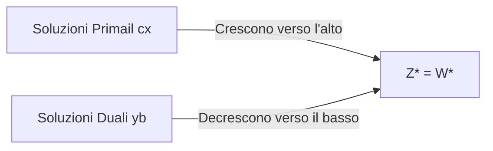

# Dualità debole e forte

La relazione quantitativa tra i valori della funzione obiettivo del problema primale e del problema duale è governata da due teoremi fondamentali.

## 1. Il Teorema di Dualità Debole

> **Teorema**: Sia $\mathbf{x}$ una soluzione ammissibile per il problema primale (MAX) e $\mathbf{y}$ una soluzione ammissibile per il problema duale (MIN). Allora:
> $$
> \mathbf{c}\mathbf{x} \le \mathbf{y}\mathbf{b}
> $$

### Interpretazione Geometrico-Operativa
- Il valore $\mathbf{c}\mathbf{x}$ di una qualunque soluzione ammissibile del primale costituisce un limite inferiore per il valore ottimo duale $W^*$.
- Il valore $\mathbf{y}\mathbf{b}$ di una qualunque soluzione ammissibile del duale costituisce un limite superiore (bound) per il valore ottimo primale $Z^*$.
- Di conseguenza, le funzioni obiettivo si muovono l'una verso l'altra: il primale massimizza spingendo dal basso, mentre il duale minimizza stringendo dall'alto.

---

## 2. Il Teorema di Dualità Forte

> **Teorema**: Se il problema primale o il problema duale ammette una soluzione ottima finita, allora anche l'altro problema ammette una soluzione ottima finita e i rispettivi valori ottimi coincidono:
> $$
> Z^* = W^* \implies \mathbf{c}\mathbf{x}^* = \mathbf{y}^*\mathbf{b}
> $$

---

## 3. Criterio Pratico di Ottimalità

Dal teorema di dualità debole e forte discende una regola fondamentale per la verifica rapida delle soluzioni:

> **Regola**: Se si individua una soluzione ammissibile primale $\mathbf{x}$ e una soluzione ammissibile duale $\mathbf{y}$ tali che i loro valori di funzione obiettivo coincidono:
> $$
> \mathbf{c}\mathbf{x} = \mathbf{y}\mathbf{b}
> $$
> allora $\mathbf{x}$ è la soluzione ottima del primale ($\mathbf{x}^*$) e $\mathbf{y}$ è la soluzione ottima del duale ($\mathbf{y}^*$).

---

## Risposta da Esame

La **dualità debole** afferma che, per ogni coppia primale-duale (MAX-MIN), il valore della funzione obiettivo primale per una soluzione ammissibile $\mathbf{x}$ è sempre minore o uguale al valore della funzione obiettivo duale per una qualunque soluzione ammissibile $\mathbf{y}$ ($\mathbf{c}\mathbf{x} \le \mathbf{y}\mathbf{b}$).
La **dualità forte** garantisce che, se primale e duale hanno soluzione ottima finita, i valori ottimi coincidono ($Z^* = W^*$). Se si trova una coppia di soluzioni ammissibili con lo stesso valore ($\mathbf{c}\mathbf{x} = \mathbf{y}\mathbf{b}$), esse sono necessariamente ottime per i rispettivi problemi.
