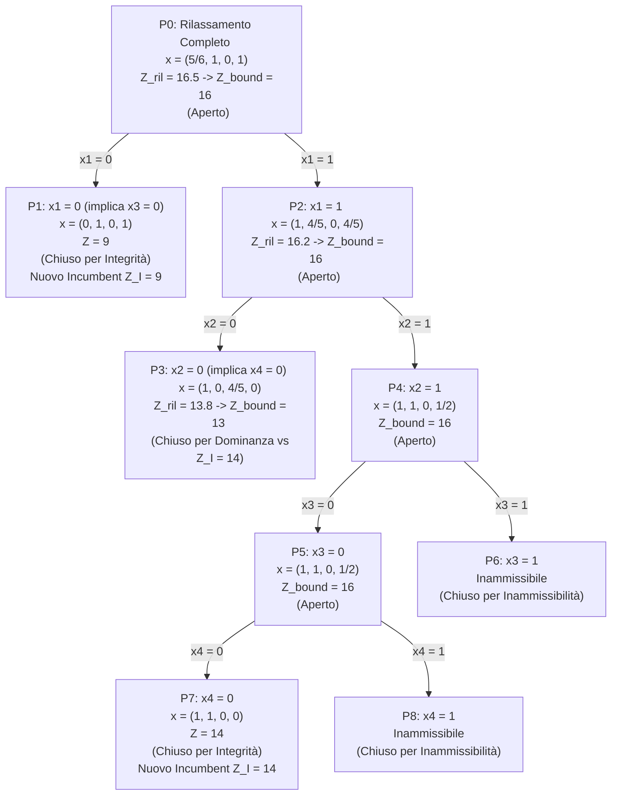

# Esempio Svolto: Branch and Bound Binario (Lombardia Manufacturing Co.)

Risoluzione passo-passo tramite l'algoritmo di Branch and Bound binario del problema decisionale Lombardia Manufacturing Co. L'esempio mostra l'applicazione dell'arrotondamento all'intero dei bound rilassati per coefficienti interi in FO.

---

## Modello Originario di PLI Binaria

Massimizzare il Valore Attuale Netto (VAN) soggetto ai vincoli di budget, mutua esclusione dei magazzini e contingenza (magazzino attivabile solo dove è presente la fabbrica):

$$
\max \quad z = 9x_1 + 5x_2 + 6x_3 + 4x_4
$$
$$
\text{s.t.} \quad 6x_1 + 3x_2 + 5x_3 + 2x_4 \le 10 \quad \text{(Budget)}
$$
$$
x_3 + x_4 \le 1 \quad \text{(Mutua Esclusione)}
$$
$$
x_3 \le x_1 \quad \text{(Contingenza Saronno)}
$$
$$
x_4 \le x_2 \quad \text{(Contingenza Gallarate)}
$$
$$
x_1, x_2, x_3, x_4 \in \{0, 1\}
$$

---

## Traccia dell'Esecuzione Algoritmica

Inizializziamo l'incumbent (migliore soluzione intera nota) a $Z_I = -\infty$.
La selezione della variabile di branching segue l'**ordinamento naturale** ($x_1, x_2, x_3, x_4$).

---

## Dettaglio dei Nodi dell'Albero

### Nodo $P_0$ (Problema completo)
*   **Vincoli**: Dominio rilassato $0 \le x_j \le 1$ per $j = 1, \dots, 4$.
*   **Soluzione Rilassamento**: $x^* = (5/6, 1, 0, 1)$ con $Z_{\text{rilassato}} = 9(5/6) + 5(1) + 6(0) + 4(1) = 7.5 + 5 + 4 = 16.5$.
*   **Bounding**: Poiché i coefficienti sono interi, arrotondiamo per difetto:
    $$Z_{\text{bound}} = \lfloor 16.5 \rfloor = 16$$
*   **Stato**: Aperto. Incumbent corrente $Z_I = -\infty$.
*   **Branching**: Scelta di $x_1$.

---

### Nodo $P_1$ (Ramo $x_1 = 0$)
*   **Vincoli aggiuntivi**: $x_1 = 0$. Per contingenza, $x_3 \le x_1 \implies x_3 = 0$.
*   **Soluzione Rilassamento**: $x^* = (0, 1, 0, 1)$ con $Z_{\text{rilassato}} = 9(0) + 5(1) + 6(0) + 4(1) = 9$.
*   **Bounding**: $Z_{\text{bound}} = 9$.
*   **Stato**: **Chiuso per ottimalità intera**. Tutte le variabili sono intere ($0$ o $1$).
*   **Incumbent**: Aggiornato a **$Z_I = 9$** con soluzione $x^{(I)} = (0, 1, 0, 1)$.

---

### Nodo $P_2$ (Ramo $x_1 = 1$)
*   **Vincoli aggiuntivi**: $x_1 = 1$.
*   **Soluzione Rilassamento**: $x^* = (1, 4/5, 0, 4/5)$ con $Z_{\text{rilassato}} = 9(1) + 5(4/5) + 6(0) + 4(4/5) = 9 + 4 + 3.2 = 16.2$.
*   **Bounding**: Arrotondiamo per difetto:
    $$Z_{\text{bound}} = \lfloor 16.2 \rfloor = 16$$
*   **Stato**: Aperto (poiché $Z_{\text{bound}} = 16 > Z_I = 9$).
*   **Branching**: Scelta di $x_2$.

---

### Nodo $P_3$ (Ramo $x_1 = 1, x_2 = 0$)
*   **Vincoli aggiuntivi**: $x_1 = 1, x_2 = 0$. Per contingenza, $x_4 \le x_2 \implies x_4 = 0$.
*   **Modello ridotto**: $\max z = 9 + 6x_3$ s.t. $6(1) + 3(0) + 5x_3 + 2(0) \le 10 \implies 5x_3 \le 4 \implies x_3 \le 4/5$.
*   **Soluzione Rilassamento**: $x^* = (1, 0, 4/5, 0)$ con $Z_{\text{rilassato}} = 9 + 6(4/5) = 13.8$.
*   **Bounding**: Arrotondiamo per difetto:
    $$Z_{\text{bound}} = \lfloor 13.8 \rfloor = 13$$
*   **Stato**: Aperto. (Sarà poi chiuso per dominanza quando $Z_I$ salirà a $14$).

---

### Nodo $P_4$ (Ramo $x_1 = 1, x_2 = 1$)
*   **Vincoli aggiuntivi**: $x_1 = 1, x_2 = 1$.
*   **Modello ridotto**: $\max z = 14 + 6x_3 + 4x_4$ s.t. $5x_3 + 2x_4 \le 1$ (derivato da $6+3+5x_3+2x_4 \le 10$), $x_3 + x_4 \le 1$.
*   **Soluzione Rilassamento**: Per massimizzare $14 + 6x_3 + 4x_4$ con $5x_3 + 2x_4 \le 1$, poniamo $x_3 = 0 \implies 2x_4 \le 1 \implies x_4 = 1/2$.
    $x^* = (1, 1, 0, 1/2)$ con $Z_{\text{rilassato}} = 14 + 4(1/2) = 16$.
*   **Bounding**: $Z_{\text{bound}} = 16$.
*   **Stato**: Aperto (poiché $16 > Z_I = 9$).
*   **Branching**: Scelta di $x_3$.

---

### Nodo $P_5$ (Ramo $x_1 = 1, x_2 = 1, x_3 = 0$)
*   **Vincoli aggiuntivi**: $x_1 = 1, x_2 = 1, x_3 = 0$.
*   **Modello ridotto**: $\max z = 14 + 4x_4$ s.t. $2x_4 \le 1$.
*   **Soluzione Rilassamento**: $x^* = (1, 1, 0, 1/2)$ con $Z_{\text{rilassato}} = 16$.
*   **Bounding**: $Z_{\text{bound}} = 16$.
*   **Stato**: Aperto.
*   **Branching**: Scelta di $x_4$.

---

### Nodo $P_6$ (Ramo $x_1 = 1, x_2 = 1, x_3 = 1$)
*   **Vincoli aggiuntivi**: $x_1 = 1, x_2 = 1, x_3 = 1$.
*   **Modello ridotto**: $5(1) + 2x_4 \le 1 \implies 2x_4 \le -4$ (**Inammissibile**).
*   **Stato**: **Chiuso per inammissibilità**.

---

### Nodo $P_7$ (Ramo $x_1 = 1, x_2 = 1, x_3 = 0, x_4 = 0$)
*   **Vincoli aggiuntivi**: $x_1 = 1, x_2 = 1, x_3 = 0, x_4 = 0$.
*   **Soluzione**: $x^* = (1, 1, 0, 0)$ con $Z = 14$.
*   **Stato**: **Chiuso per ottimalità intera**.
*   **Incumbent**: Aggiornato a **$Z_I = 14$** con soluzione $x^{(I)} = (1, 1, 0, 0)$.

---

### Nodo $P_8$ (Ramo $x_1 = 1, x_2 = 1, x_3 = 0, x_4 = 1$)
*   **Vincoli aggiuntivi**: $x_1 = 1, x_2 = 1, x_3 = 0, x_4 = 1$.
*   **Modello ridotto**: Il vincolo di budget $5(0) + 2(1) \le 1 \implies 2 \le 1$ (**Inammissibile**).
*   **Stato**: **Chiuso per inammissibilità**.

---

## Chiusura per Dominanza dei Nodi Rimanenti

A questo punto la migliore soluzione intera ha valore $Z_I = 14$.
*   **Analisi di $P_3$**: Il bound associato al nodo $P_3$ è $Z_{\text{bound}} = 13$.
*   Poiché $13 \le Z_I = 14$, il nodo $P_3$ non potrà mai produrre una soluzione migliore di quella già trovata.
*   **Stato**: **Chiuso per dominanza**.

Non essendoci altri nodi aperti, l'algoritmo termina. La soluzione ottima del problema è:
$$x^* = (1, 1, 0, 0) \quad \text{con } z^* = 14$$
*(Ossia: costruire la fabbrica a Saronno e a Gallarate, senza magazzini).*
